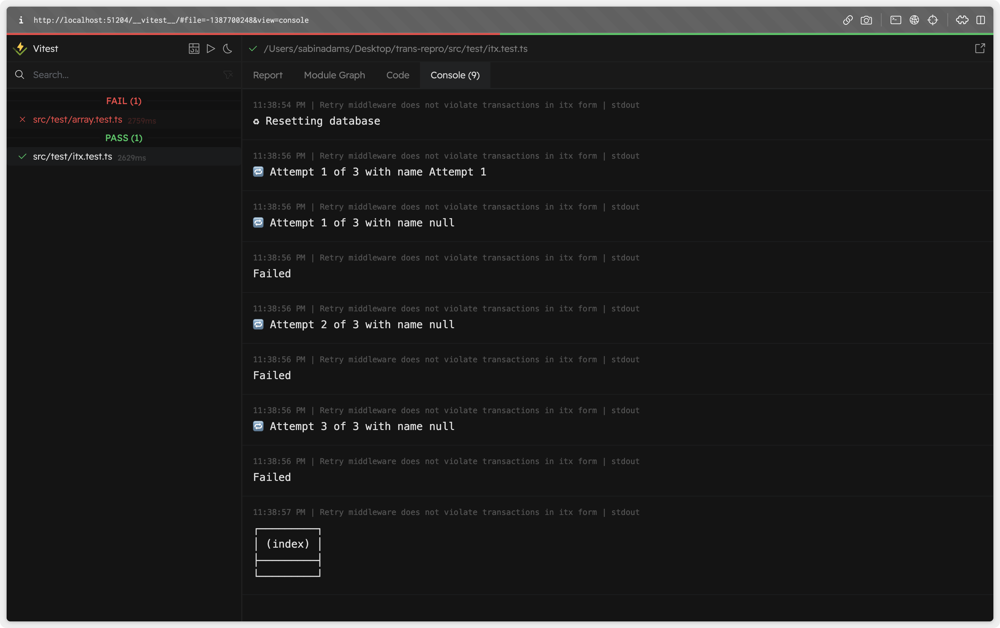
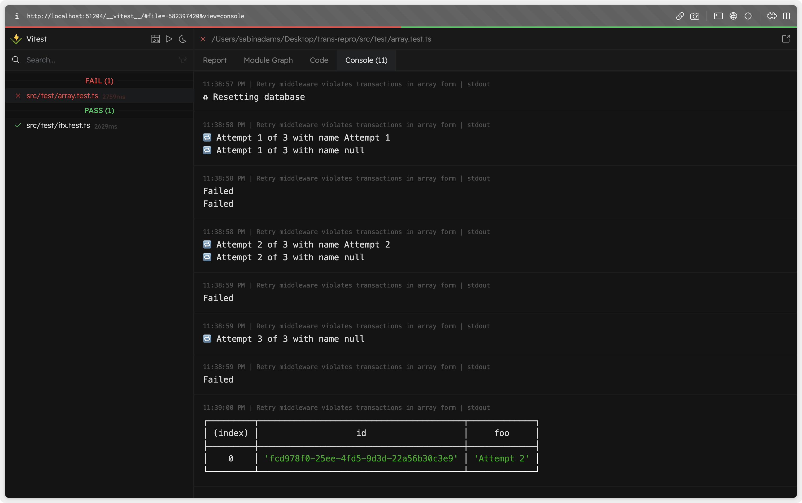

# Reproduction of an issue

The issue [here](https://github.com/prisma/prisma/issues/19145) here describes unexpected behavioral differences between Array transactions and Interactive transactions when a middleware is involved.

The Tl;dr of the problem is that the following results in two different behaviors:

```ts
import { PrismaClient } from "@prisma/client";
import { retryMiddleware } from "./middleware";
const db = new PrismaClient();
db.$use(retryMiddleware);

// array
await db.$transaction([
  createARecord, 
  failAQuery
])
// itx
await db.$transaction((tx) => {
  await createARecord()
  await failAQuery()
})
```

The array-based transaction leaves one record in the database when you would expect the failure to roll back any data changes.

The interactive transaction correctly rolls back the changes.

## Findings

In this repo I have set up two tests.

> **Note**
> To run the tests, run `npm run test:ui`. If prompted to, install `@vitest/ui` by selecting `'y'` and run the command again.

I've added logging in the middleware to log each attempt and an indicator about whether or not that attempt passed. It then logs the entire table to see if any data is left.

### Interactive Transaction



We can see here the successful attempt passes.

Next, the failure-inducing invocation occurs triggering a retry. These happen until the retry limit is reached and the function fails. 

The table at the end shows no records, indicating the rollback was successful.
### Array Transaction


When using an array transaction, we can see rather than running the first function, checking if it was successful and then moving on to the next one, it actually runs _BOTH_ functions on attempt 1. 

The second function of attempt 1 fails, so both are considered failed. It then moves on to attempt 2. 

There, it begins to behave differently. Attempt 2 with a proper name actually succeeds and the one with no name fails. We see only one failure. 

That failed one continues to retry until the retry limit is reached.

Because Attempt 2 did have a successful run, that record is still in the database. No rollback occurred there (_BAD_).

## Theories

When using array transactions in a middleware, both functions are not depend on each other's success after the first attempt. 
